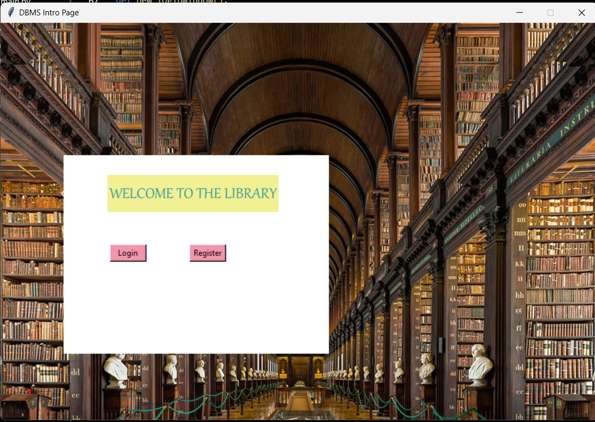
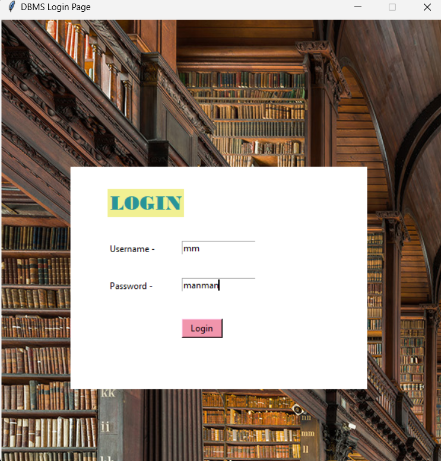
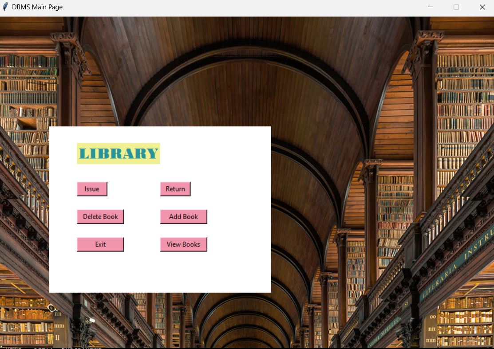

# 📚 Library Management System

This is a Python-based Library Management System developed using Tkinter for the GUI. It allows users to manage and interact with a library system, providing functionalities like user login & book management
## ⚡ Features

- **🔒 User Login**: Secure login window for users to access the system.
- **📚 Book Management**: Admin or user functionalities for managing books (add, remove, search, etc.).
- **🖥️ Tkinter GUI**: Interactive and user-friendly interface with images as backgrounds.
- **📱 Responsive Design**: The window adapts to different screen sizes.

## 🛠️ Prerequisites

To run this project, you'll need to have Python 3.x installed on your system along with the following libraries:

- **Tkinter** (for GUI)
- **Python Imaging Library (PIL)** or **Pillow** (for handling images)

## Screenshots

## 🤝 Contributing
Contributions are welcome! Feel free to fork the repository and submit pull requests for bug fixes, improvements, or additional features.

 
